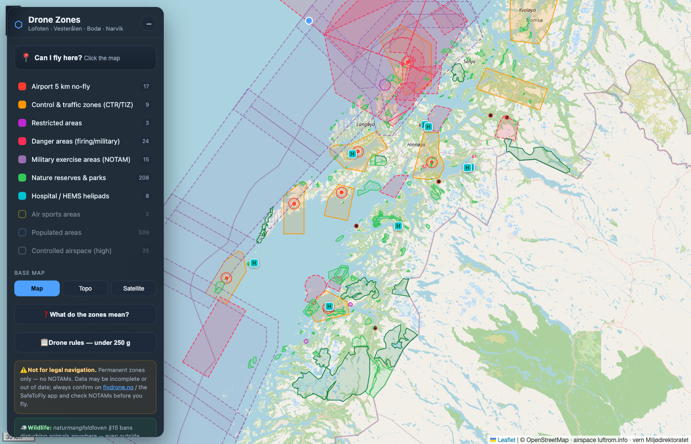

# Drone Zones — Lofoten · Vesterålen · Bodø · Narvik

An offline-capable map of the **permanent** drone-flight restrictions around the
Lofoten region of Northern Norway: airport zones, control zones, restricted &
military danger areas, protected nature, and built-up areas.

> ⚠️ **Not for legal navigation.** The data is assembled from public/community
> sources and may be incomplete or out of date. It does **not** include temporary
> restrictions (NOTAMs). Always confirm on **[flydrone.no](https://flydrone.no)**
> and the **SafeToFly** app, and check NOTAMs, before every flight.



## What it shows

| Layer | What it is | Source | Authority |
|---|---|---|---|
| **Airport 5 km no-fly** | 5 km ring around the 7 airports with scheduled air traffic service (Bodø, Evenes, Andøya, Leknes, Svolvær, Stokmarknes, Røst). Uncontrolled airstrips & heliports are advisory markers only. | [OurAirports](https://ourairports.com/) | Crowd-sourced, locations verified |
| **Control & traffic zones (CTR/TIZ)** | Control zones (Bodø, Evenes, Andøya, Bardufoss, Tromsø) and AFIS traffic info zones (Leknes, Helle/Svolvær, Skagen/Stokmarknes, Røst). All ground level. | [luftrom.info](https://luftrom.info) (from Avinor AIP) | AIP-derived; **cross-checked vs official AIP** |
| **Restricted areas** | AIP ENR 5.1 restricted airspace (R423/425/426). | luftrom.info | AIP-derived & verified |
| **Danger areas (firing/military)** | AIP ENR 5.1 danger areas (firing ranges, Andøya rocket range). Blocking, but active only at set times — check NOTAM. | luftrom.info | AIP-derived & verified |
| **Military exercise areas (NOTAM)** | AIP ENR 5.2 exercise/training areas — the large blocks over the sea. **Active only when activated by NOTAM**, so treated as conditional (non-blocking) context, not a permanent no-fly. | luftrom.info | AIP-derived & verified |
| **Hospital / HEMS helipads** | Air-ambulance helipads (Bodø, Narvik, Stokmarknes, Harstad, Værøy). | [OpenStreetMap](https://www.openstreetmap.org/) | Crowd-sourced |
| **Air sports areas** | Paraglider/parachute/GA activity areas (AIP ENR 5.5). Off by default — advisory hazard. | luftrom.info | AIP-derived |
| **Nature reserves & parks** | National parks, nature reserves, landscape & marine protected areas; seabird reserves flagged for the seasonal nesting ban. | [Miljødirektoratet](https://kart.miljodirektoratet.no/) | **Official government data** |
| **Populated areas** | Towns/villages + residential land. Off by default. | OpenStreetMap | Crowd-sourced |
| **Controlled airspace (high)** | TMA/CTA (high floor). Off by default — context only, above the 120 m drone ceiling. | luftrom.info | AIP-derived |

The **"Can I fly here?"** check scans every layer (even hidden ones), gives a
clear/blocked verdict at ≤120 m, and — when clear — reports the **distance and
bearing to the nearest no-fly zone** so you know your margin.

The **"Drone rules — under 250 g"** button opens an in-app reference of the
*operational* rules (registration, altitude, VLOS, people, age, insurance,
privacy, wildlife) that apply on top of the map zones — each line cited to the
exact provision, read from the primary law (see below).

### Operational rules for a sub-250 g drone (read from primary law)

These apply regardless of where you fly and are summarised in-app:

- **Registration** required if the drone has a camera/sensor — *even under 250 g*
  (camera-free or certified-toy drones exempt). `EU 2019/947 Art 14(5)`
- **No exam/course** for a sub-250 g (C0/self-built) drone. `UAS.OPEN.020(4)`
- **120 m** max above the closest ground; **VLOS** at all times.
  `UAS.OPEN.010(2)` · `Art 4(1)(d)`
- **A1:** may overfly individuals, **never crowds/assemblies.** `UAS.OPEN.020(2)`
- **Min age 16** (exceptions for self-built <250 g / toy-C0 / supervised). `Art 9`
- **Insurance** not required <250 g; ≥250 g needs 750 000 SDR.
  `BSL A 7-2 §6` · `luftfartsloven §11-2` · `FOR-2004-07-06-1101 §4`
- **5 km from airports** / not near military, embassies, prisons.
  `BSL A 7-2 §7` (FOR-2024-11-01-2777, current Norwegian regulation)
- **Wildlife** must not be disturbed anywhere. `naturmangfoldloven §15, §6`
- **Privacy:** GDPR applies to identifiable footage; consent to publish.
  `personopplysningsloven` · `GDPR Art 2(2)(c)`
- **Military photography** needs NSM permission. `FOR-2018-06-22-951 §6`

Sources: [EUR-Lex 2019/947](https://eur-lex.europa.eu/legal-content/EN/TXT/HTML/?uri=CELEX:32019R0947),
[2019/945](https://eur-lex.europa.eu/eli/reg_del/2019/945/oj),
[BSL A 7-2 (Lovdata)](https://lovdata.no/dokument/SF/forskrift/2024-11-01-2777),
[luftfartsloven §11-2](https://lovdata.no/lov/1993-06-11-101/§11-2),
[naturmangfoldloven §15](https://lovdata.no/lov/2009-06-19-100/§15),
[Datatilsynet drone guidance](https://www.datatilsynet.no/personvern-pa-ulike-omrader/overvaking-og-sporing/droner---hva-er-lov/).

### The rules behind the layers (verified against [Luftfartstilsynet](https://www.luftfartstilsynet.no/en/drones/) & [Miljødirektoratet](https://www.miljodirektoratet.no/ansvarsomrader/vernet-natur/regler-for-droner-i-naturen/))

- **Max 120 m** above the closest point of the surface (EU open category).
- **5 km from airports** without permission from the air traffic service. *(This rule
  is transitioning to a CTR-based rule — both are shown.)*
- **No flying over/near** military areas/vessels, prisons, embassies.
- **National parks**: drones forbidden as a general rule. **Nature reserves**: banned
  in many areas, especially **bird/seabird reserves** — take-off, landing *and* flying
  in are all banned where it applies. No high-altitude exemption. Check each area's
  *verneforskrift* (linked in popups).
- **Wildlife (everywhere, even outside marked zones):** *naturmangfoldloven §15*
  prohibits disturbing wildlife — enforced by fines. Many **seabird reserves are
  closed (ferdselsforbud) ~15 Apr–31 Jul** during nesting.
- Keep clear of people; never fly over crowds/assemblies.

### Data accuracy / audit

The airspace was independently cross-checked against the **official Avinor eAIP,
AIRAC 2026-06-11** (current edition): all 5 CTRs and 4 TIZs confirmed ground-level;
all 3 restricted and the danger areas confirmed present (the `END5xx` series are
genuine ENR 5.2 *military exercise* areas, not errors). Protected-area rules were
verified against Miljødirektoratet and Lovdata. High-altitude-only areas above the
120 m drone ceiling (e.g. ALOMAR upper, FL105+) are intentionally not all included.
Still: **this is a planning aid, not a legal source — verify before flying.**

## Run it

It must be served over HTTP (the browser blocks `fetch` of local files over `file://`):

```bash
cd "Norway map"
python3 -m http.server 8765
# then open http://localhost:8765
```

Click **"Can I fly here?"** then click anywhere on the map to see which
restrictions apply at that point (it checks every layer, even hidden ones).

## Refresh the data

The `data/*.geojson` files are committed so the app works without a build step.
To pull the latest from all sources:

```bash
node scripts/build-data.mjs
```

No npm install needed (Node 18+, uses built-in `fetch`). The region, buffer
distance, and source URLs live in `config.json`.

## Project layout

```
index.html / app.js / style.css   the map (Leaflet, no framework, no build)
tiles.mjs / offline.mjs            offline PWA: tile math + Kartverket basemap + region download
sw.js / manifest.webmanifest       service worker + manifest (installable, fully offline)
icons/                             PWA / home-screen icons
vendor/                            Leaflet 1.9.4, vendored for offline use
data/*.geojson                     generated restriction layers
scripts/build-data.mjs             the data pipeline (fetch → clip → normalize)
scripts/tiles.test.mjs             unit tests for the tile math (node --test)
scripts/offline-assets.test.mjs    invariants: shell assets exist, cache name in sync
config.json                        region bbox, airport rules, offline zoom range, source URLs
```

Run the unit tests (tile math + offline-asset invariants) with `node --test`
(no deps, Node 18+).

## Offline use on iPhone (phase 2)

The app installs as a **PWA** and works with **no signal** in the field. A service
worker (`sw.js`) pre-caches the app shell and all restriction data; a web app
manifest makes it installable to the iOS home screen. The only thing that needed
the network is the basemap — so there's a **Norway** basemap (official
[Kartverket](https://www.kartverket.no/) topographic tiles, CC BY 4.0, the one
basemap whose licence permits offline caching) and a **Save map for offline**
button that pre-downloads the region's tiles into a durable cache.

**Field setup (do this on Wi-Fi):**

1. Host the static files over **HTTPS** (e.g. GitHub Pages — service workers need
   HTTPS or `localhost`). Relative paths mean it works at a domain root or a
   project subpath unchanged.
2. Open it in Safari **while online**, then **Share → Add to Home Screen**.
3. Open the installed app (still online — this first launch is when the service
   worker installs and caches the app shell), tap **⬇ Save map for offline
   (Norway)**, and wait for it to finish.
4. Go fly. With no signal: open the app, switch to the **Norway** basemap, and the
   map + every zone work straight from the cache.

**Coverage / size:** the download covers the whole region at zoom 5–12 (~10,500
tiles, ~150 MB) — the practical ceiling for iPhone storage. Tune `config.json` →
`offline.maxZoom` for more detail (z13 ≈ 600 MB) or less. Zooming past the cached
level upscales the deepest cached tiles rather than showing blank ones. The
size/usage figures shown in-app are approximate, and iOS may evict cached data
after long disuse — just re-tap **Save map for offline** if the basemap looks
empty after weeks unused.

The other basemaps (OpenStreetMap, OpenTopoMap, satellite) remain for online use;
tiles you view online are cached opportunistically, but only **Norway** is
bulk-downloadable for guaranteed offline coverage.

**Updating a deployed copy:** restriction data (`data/*.geojson`) and `config.json`
are served *network-first*, so corrections reach installed users automatically the
next time they open the app online. The app *shell* (HTML/JS/CSS) is cached for
instant offline loads — when you change shell code, bump `SHELL_CACHE` in `sw.js`
(e.g. `drone-shell-v2`) so the service worker re-caches it. The tile cache is never
auto-purged, so a release never forces users to re-download the ~150 MB of tiles.
